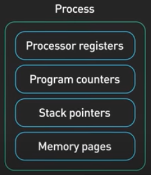
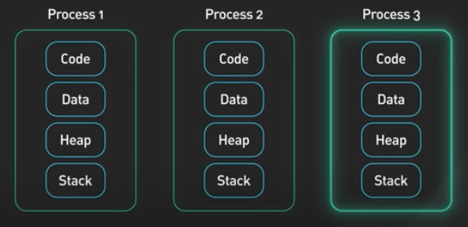
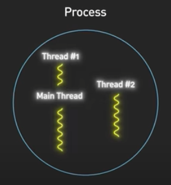
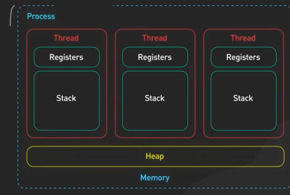
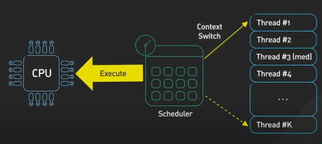

# Processes vs. Threads

## Processes
**_What's a program?_**
A program is an executable file that contains code, which is a set of processor instructions, that is stored as a file on disk.

**_What's a process?_** When the code in a program is loaded into memory and executed by the processor, it becomes a **process**. In addition, an active process includes the resources that a program needs to run, which are managed by the OS.

**_What are examples of resources needed for a process to run_?** Processor registers, program counters, stack pointers, memory pages assigned to the process for its heap and stack, etc.

_**What's an important attribute of processes?**_ Each process has its own memory address space. Therefore, a single process cannot corrupt the memory space of another process. If one process malfunctions, other processes can keep running. 

One example of this is in Chrome where each tab is running as its own separate process. If one tab is not working, the other tabs are unaffected.

## Threads
_**What is a thread?**_ A thread is a unit of execution within a process. A process has at least one thread, which is called the main thread. 

Threads within a process have a **shared memory address space**. It is possible for threads to communicate using that shared memory space. However, one misbehaving thread can bring down the entire process. 

### How does an OS run a thread or a process on a CPU?
This is handled by context switching. During a context switch, one process is switched out of the CPU so that another process can run.

The OS stores the states of a currently running process so that the process can be restored and resume execution at a later point. 

Context switching is expensive. It involves saving and loading registers, switching out memory pages, and updating various kernel data structures. 

Switching execution between threads also requires context switching. It is generally faster to switch contexts between threads than between processes. Since threads shared the same memory space, there's no need to switch out virtual memory pages.

### Sources
https://www.youtube.com/watch?v=4rLW7zg21gI&t=10s