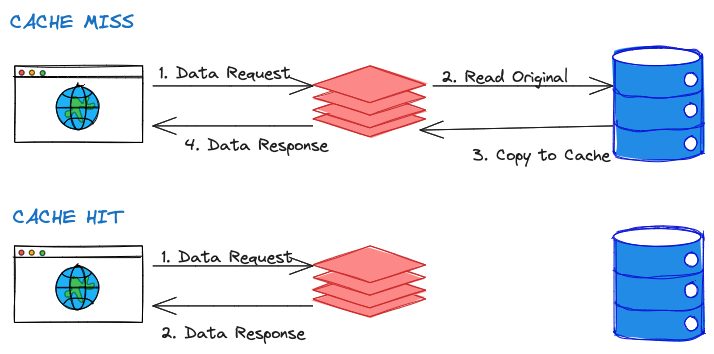

## CACHING

### What is a cache? 
A cache is a small memory, fast-access local store to store frequently accessed data. It stores copies of frequently used application data in a layer of smaller, faster memory in order to improve data retrieval times, throughout and compute costs.

### What is locality?
Caching is based on the principal of locality. There are two kinds: 
1. Temporal Locality: Data that has been referenced recently is likely to be referenced again. 
2. Spatial Locality: Data that is stored near recently referenced data is also likely to be referenced again.  

### How does a cache work? 
If a copy of the data is in a cache, then it's a *cache hit*. If it's not, then it's a *cache miss*.

_Diagram 1_:

[Image Source](https://medium.com/geekculture/system-design-basics-caching-46b1614915f8)

## What are the types of caches?

### Global Cache
ABOUT:
- Global (central) cache lives near app servers and primary DBs
- Use key-value data model

 PROS:
 - Reduce overall app latency. 
 - Can be used to reduce load on the primary DB, improve scalability, reduce cos
 - Data invalidation is easier with a central cache than other types

CONS:
- Added operational burden and availability impacts from a central cache 

  

### Local Cache
ABOUT: 
- Local caches stores cached data in a decentralized way (e.g. as close as possible to the client that needs the data)
- Data can be cached in the browser's local storage
- Data can also be stored on the application servers

PROS:
- Eliminate network requests to downstream services
- Reading value from memory is orders of magnitude faster than making a network request

CONS:
- Can be challenging to proactively purge cached values when the underlying data has changed
- Requires for you to think about how often to hold cache data and dealing with stale data

Caching data on the browser:

Caching data on the application server:

### Edge Caching
An edge cache stores content at multiple different locations at the edge of one's network. It stores copies of content in servers located close to the user. 

CDNs and DNS are common types of edge caches. 
* CDN stores static files (images), videos or JavaScript bundles
* DNS is used to route a website domain to a specific server to handle that request

PROS: 
- Since edge caches are more centralized, invalidation is easier than on distributed local caches

CONS:
- Invalidations on edge caches are not expected to happen at a high rate 
- Some CDNs charge money for each invalidation 

#### Sources:
- [Cut the caching clutter: understanding cache types](https://www.gomomento.com/blog/cut-the-caching-clutter-understanding-cache-types)
- [System Design Basics: Caching](https://medium.com/geekculture/system-design-basics-caching-46b1614915f8) - An article on Medium discussing the basics of caching in system design.
